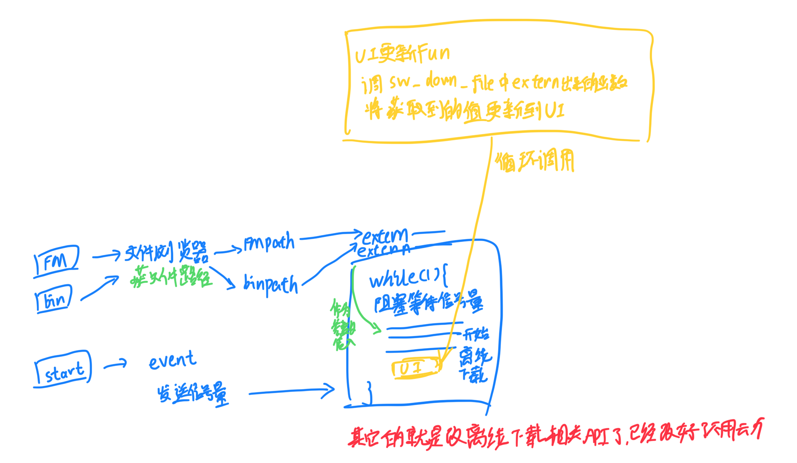

### 功能

> [!Warning]
>
> DAC波形输出功能已经实现，但我没有示波器，没法验证!!!

1. 在线DAPLink

2. 脱机DAPLink

3. PWM输出

4. 舵机控制

5. 逻辑分析仪(依赖外挂树莓派Pico)

6. DAC波形输出

   功能已经实现，但我没有示波器，没法验证⚠

### 端口说明

- SWCLK: PE7
- SWDIO: PE8
- TX: PD8
- RX: PD9

### 已知BUG

- [ ] 文件浏览器无法点击目录，点击目录直接死机

  应该是文件系统API没改造完成

- [ ] 脱机烧录烧两次只会成功一次

  需要尝试端点后再次连接后即可烧录成功，原因暂时未知

- [ ] 触摸屏静置一段时间后会偏移

  不影响体验，只会在LV_LOG下能看到

### TODO

- [ ] 添加页面管理，目前只有脱机下载一个界面，后期需要根据页面执行不同逻辑
- [ ] 添加更多功能

### 注意事项

- 重新生成项目后，记得到Cmake文件中添加源文件(如有修改请增加)，以及取消FPU的注释

  ```c
  file(GLOB_RECURSE SOURCES "Core/*.*" "Package/LVGL/*.*" "FATFS/*.*" "Middlewares/*.*" "Drivers/*.*"
          "Package/CherryUSB/core/usbd_core.c"
          "Package/CherryUSB/class/cdc/usbd_cdc.c"
          "Package/CherryUSB/port/dwc2/usb_dc_dwc2.c"
          "Package/CherryUSB/port/dwc2/usb_glue_st.c"
          "Package/CherryRB/chry_ringbuffer.c"
          "Package/DAPLink/*.*"
          "Package/GUIAPP/*.*"
          "Package/lv_lib_100ask/src/*.*"
          "Package/offline_download/*.*"
          "Package/flmparse/*.*"
          "Package/PageManager/*.*"
  )
  ```

- 如在CubeMX中添加了新的外设，需要到main.c中将其的初始化从`#if 0`中拉出来，这是我为了USB而做的，否则每次重新生成都要注释很麻烦😁

### 版本说明

1. 修复脱机下载功能: 
   1. UI切换导致空间名称不同，选择路径返回时修改了不该动的路径导致系统卡死
   2. UI文件增大导致FreeRTOS内存不足，导致离线下载线程压根没有启动以及算法解析的malloc失败导致下载失败
2. 新增舵机控制；
   1. 貌似有点供电不足，舵机旋转的时候屏幕亮度会变暗


**脱机下载逻辑:**

